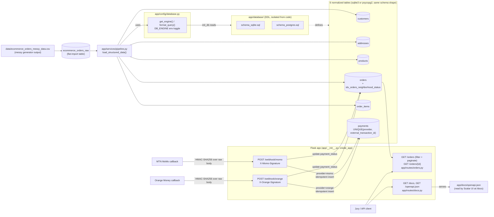

# AntCode Commando — E-Commerce Logistics Platform

A Cameroon-focused e-commerce logistics backend: it ingests a deliberately
messy raw orders export, cleans and normalizes it into a relational SQLite
schema, exposes neighborhood/delivery-status order lookups over a composite
index built for that access pattern, and processes idempotent MTN MoMo /
Orange Money payment callbacks. Built strictly test-first — see
[`.agents/skills/test-driven-development/SKILL.md`](.agents/skills/test-driven-development/SKILL.md).

## Architecture



`orders` carries a denormalized snapshot of `customer_neighborhood` and
`delivery_status` (alongside the normalized `addresses` table) specifically
so `idx_orders_neighborhood_status` can answer neighborhood/status lookups
without a join — see
[`docs/indexing_and_query_optimization_report.md`](docs/indexing_and_query_optimization_report.md).

## Project layout

```
app/
├── __init__.py                     # create_app() factory, registers all blueprints
├── config/
│   └── database.py                 # get_connection(), init_db(), get_engine(), format_query()
│                                    #   -- toggles sqlite3 / psycopg2 via DB_ENGINE env var
├── database/
│   ├── schema_sqlite.sql           # the 6-table schema + indexes (sqlite3)
│   └── schema_postgres.sql         # same schema adapted for PostgreSQL (SERIAL/VARCHAR/TIMESTAMP)
├── docs/
│   └── openapi.json                # OpenAPI 3.0 spec (static file, served as-is)
├── routes/
│   ├── docs.py                     # GET /docs (Scalar UI), GET /openapi.json
│   ├── orders.py                   # GET /orders (filter + paginate), GET /orders/{id}
│   └── webhooks.py                 # POST /webhook/momo, POST /webhook/orange
└── services/
    ├── orders.py                   # order lookup + pagination queries
    ├── pipeline.py                 # ecommerce_orders_raw -> 6 tables ETL
    └── webhooks.py                 # idempotent MoMo/Orange callback processing
scripts/
├── generate_mock_transactions.py   # generates the messy CSV + loads ecommerce_orders_raw
└── load_structured_orders.py       # runs the ETL against ecommerce.db
docs/
└── indexing_and_query_optimization_report.md
tests/
├── conftest.py                     # app/client fixtures shared by every test module
├── test_database.py
├── test_docs_routes.py
├── test_generate_mock_transactions.py
├── test_orders_routes.py
├── test_pipeline.py
└── test_webhooks.py
run.py                               # dev entry point (python run.py)
requirements.txt
README.md
```

## Getting started

```bash
pip install -r requirements.txt

# 1. Generate the messy raw dataset and load it into ecommerce_orders_raw
python scripts/generate_mock_transactions.py

# 2. Clean/normalize it into the 6 structured tables
python scripts/load_structured_orders.py

# 3. Run the API
MOMO_WEBHOOK_SECRET=your-momo-secret ORANGE_WEBHOOK_SECRET=your-orange-secret python run.py
```

`DB_ENGINE` defaults to `sqlite` (no env var needed for local dev). Set
`DB_ENGINE=postgresql` and `DATABASE_URL=...` to run against PostgreSQL
instead — `app/config/database.py` picks the matching schema file from
`app/database/` and swaps `?` placeholders for `%s` via `format_query()`
automatically.

### Running with an aggregator (Campay, Smobilpay, ...)

`POST /webhook/aggregator` is a single generic route that verifies against
whichever provider `DEFAULT_AGGREGATOR` names, using that provider's own
secret and signature header from `_PROVIDER_CONFIG`
(`app/routes/webhooks.py`) — adding a new aggregator later is a config-map
entry, not a new route. It defaults to `campay` if unset:

```bash
DEFAULT_AGGREGATOR=campay CAMPAY_WEBHOOK_SECRET=secret python run.py
```

Swap to Smobilpay the same way: `DEFAULT_AGGREGATOR=smobilpay
SMOBILPAY_WEBHOOK_SECRET=secret python run.py`. `momo` and `orange` are not
selectable through `DEFAULT_AGGREGATOR` — they keep their own dedicated
`/webhook/momo` and `/webhook/orange` routes regardless of this setting.

Then open **http://127.0.0.1:5000/docs** for the interactive Scalar API
reference, or **http://127.0.0.1:5000/openapi.json** for the raw spec.

## API

| Route | Method | Purpose |
|---|---|---|
| `/orders` | GET | List orders, optional `?neighborhood=` and/or `?status=` filters — served by `idx_orders_neighborhood_status` — plus `?page=` (default 1) and `?per_page=` (default 20). Response is `{"data": [...], "pagination": {"page", "per_page", "total_records", "total_pages"}}` |
| `/orders/{order_id}` | GET | Fetch a single order (404 if unknown) |
| `/webhook/momo` | POST | MTN MoMo payment callback. Requires `X-Momo-Signature`: hex HMAC-SHA256 of the raw body, keyed with `MOMO_WEBHOOK_SECRET`. Idempotent on `(provider, external_transaction_id)` |
| `/webhook/orange` | POST | Orange Money payment callback. Requires `X-Orange-Signature`: hex HMAC-SHA256 of the raw body, keyed with `ORANGE_WEBHOOK_SECRET`. Idempotent on `(provider, external_transaction_id)` |
| `/webhook/aggregator` | POST | Payment callback for whichever aggregator `DEFAULT_AGGREGATOR` names (`campay` by default; `smobilpay` also wired). Requires that aggregator's own signature header (e.g. `X-Campay-Signature`) keyed with its own secret (e.g. `CAMPAY_WEBHOOK_SECRET`), from `_PROVIDER_CONFIG`. Same idempotency guarantee as the two routes above |
| `/docs` | GET | Interactive Scalar API reference — try all endpoints above from the browser |
| `/openapi.json` | GET | OpenAPI 3.0 spec backing `/docs` (`app/docs/openapi.json`) |

## Testing

```bash
python -m pytest -v
```

47 tests, 100% passing (`python -m pytest -v`). Every behavior above —
including the schema, the ETL, the dual-engine connection layer, the
multi-provider/aggregator webhooks, and the paginated order lookup — was
written test-first: a failing test proving the gap, then the minimal code
to close it, per the project's
[TDD skill](.agents/skills/test-driven-development/SKILL.md).

## Cameroonian context adaptation

### ETL choice: synthesizing identity the raw data doesn't have

`ecommerce_orders_raw` is a flat logistics export — one row per order, with
a neighborhood and a product category, but **no customer name/phone and no
product SKU**. A normalized schema needs real entities, so
`app/services/pipeline.py::load_structured_data()` makes two explicit,
documented calls rather than silently guessing:

- **One synthetic customer per raw order row**, deterministically derived
  from the raw `order_id` (the only stable identity the source offers) —
  matching the actual grain of the data instead of inventing a fake
  dedup key.
- **Products deduped by category**, with the master `unit_price_fcfa` taken
  from the first valid row seen for that category; each `order_items` row
  still keeps its own transactional price from the raw record, so historical
  pricing isn't lost to the dedup.
- **Neighborhood → city** is resolved from a real Douala/Yaoundé lookup
  table (`NEIGHBORHOOD_CITY` in `pipeline.py`) — Akwa, Bonapriso,
  Bonamoussadi, Deido and New Bell map to Douala; Bastos, Mendong, Nlongkak,
  Biyem-Assi and Ngousso map to Yaoundé — rather than a placeholder city.

### The Biyem-Assi text-collapsing anomaly

The raw generator injects casing noise (`akwa`, `AKWA`, `Akwa `) *and*, for
hyphenated neighborhoods, a **space variant** — `Biyem-Assi` also appears as
`Biyem Assi`. A naive `.title()` pass fixes casing but leaves `Biyem Assi`
and `Biyem-Assi` as two different strings, which would silently split one
neighborhood's orders across two buckets in every downstream count and in
`idx_orders_neighborhood_status` itself.

`normalize_neighborhood()` catches this by snapping any casing/spacing
variant of a known neighborhood to one canonical spelling (see
`_canon_key()` / `_CANONICAL_NEIGHBORHOODS` in `pipeline.py`), verified by
`tests/test_pipeline.py::test_normalize_neighborhood_collapses_hyphen_space_variant_to_canonical_name`
and confirmed end-to-end against the full 912-row loaded dataset: exactly
10 distinct neighborhoods, no duplicates.

### Network timeout protection: idempotent webhook

3G connectivity drops in Douala/Yaoundé are routine, and payment providers
retry a callback when they don't get an acknowledgement in time. If that
retry were processed twice, an order could get double-charged or its
`payment_status` flipped back and forth. `POST /webhook/momo`
(`app/services/webhooks.py::process_momo_callback`) gates on
`payments.external_transaction_id`, which is `UNIQUE` in the schema: the
first callback for a given transaction ID inserts the payment and updates
the order; every retry of that same transaction ID is recognized before any
write and answered with `{"status": "already_processed"}` — same result,
zero duplicate writes. Enforced at both the application layer (a lookup
before insert) and the database layer (the `UNIQUE` constraint as a
backstop), and proven by
`tests/test_webhooks.py::test_momo_webhook_does_not_double_process_retried_callback`,
which posts the identical callback twice and asserts exactly one payment
row exists afterward.

Authenticity is checked with a real HMAC, not a bare shared secret: the
caller sends `X-Momo-Signature`, the hex HMAC-SHA256 of the *raw request
body* keyed with `MOMO_WEBHOOK_SECRET`
(`app/routes/webhooks.py::_has_valid_signature`, compared with
`hmac.compare_digest` to avoid timing attacks). That binds the signature to
the exact bytes received, so a signature computed over one payload will not
validate a tampered one — proven by
`test_momo_webhook_rejects_tampered_payload_even_with_valid_looking_signature`,
which reuses a genuine signature against a modified `amount_fcfa` and
asserts it's rejected.

### Limit/Offset pagination: saving 3G data and battery

`GET /orders` with no bounds would ship every row in one response —
expensive on the metered, throttled 3G/4G connections common in Douala and
Yaoundé, and on phones where every extra second of radio activity drains the
battery. `app/services/orders.py::list_orders()` now takes `page`/`per_page`
(defaults 1/20) and appends `LIMIT ? OFFSET ?` to the query — through
`format_query()`, so the same code paginates correctly whether the query
runs against sqlite3 or PostgreSQL. The response never asks a client to
guess: `pagination.total_records` and `pagination.total_pages` are computed
from a `COUNT(*)` over the *same* filtered `WHERE` clause as the page
itself, so a field agent's app can request exactly the next page it needs —
and nothing more — instead of re-fetching or truncating a full list
client-side.

### Dual-operator webhook safety gates

Field agents and customers pay with whichever operator has signal and float
at the moment — MTN MoMo and Orange Money both, often interchangeably.
`POST /webhook/momo` and `POST /webhook/orange` are two distinct Flask
routes (`app/routes/webhooks.py`), each checked against its *own* shared
secret (`MOMO_WEBHOOK_SECRET` / `ORANGE_WEBHOOK_SECRET`) and its own
signature header (`X-Momo-Signature` / `X-Orange-Signature`) before either
touches the database — a request signed with Orange's secret is rejected on
the momo route and vice versa
(`test_momo_webhook_rejects_orange_signature_for_the_momo_route`). The
provider identity stored against each payment is taken from the *route
that verified the signature*, never from a client-supplied field in the
JSON body, closing off a class of bug where a forged or mistaken `provider`
value in the payload could point a payment at the wrong operator's ledger.

This also fixes a latent collision risk: the idempotency lock used to be
keyed on `external_transaction_id` alone, so if MTN and Orange ever
independently minted the same transaction ID string, the second operator's
real payment would have been silently discarded as a duplicate. The lock is
now `UNIQUE(provider, external_transaction_id)` in both schema files, and
`test_momo_and_orange_callbacks_reusing_the_same_transaction_id_are_independent`
posts the same transaction ID to both routes and asserts both are processed
as distinct payments.

## AI Prompt Ledger

This project was built with Claude Code, directed through recurring
commands: **`/goal`** to hand off a scoped, multi-step directive for
autonomous TDD execution; **`/clear`** to reset context between unrelated
phases so each phase starts from a clean slate instead of accumulating
unrelated history; **`/run`**, used in this project to execute the verified
`git add`/`git commit` for a phase once its full suite was green (rather
than its more common use of launching and driving an app); and **`/plan`**,
available for phases where the approach itself needs to be worked out with
a human before any code is written — not invoked as an explicit command in
this session's transcript; the CLI auto-toggled plan mode around the first
`/goal` below with no separate planning dialogue to log, since each `/goal`
directive already scoped the work precisely enough to go straight into the
TDD red/green/refactor loop.

| Phase | Trigger | Scope | Result |
|---|---|---|---|
| Initial scaffold | *(prompt predates this session's context — not preserved; see commit `abf00a7`)* | Repo scaffold: `app/schema.sql` (6-table schema), `app/database.py`, TDD skill files | `abf00a7 first commit` |
| Mock data generation | *(prompt predates this session's context — not preserved; see commit `268d41b`)* | Messy CSV generator, `ecommerce_orders_raw` loader, `clean_row`/`insert_orders` tests | `268d41b feature: data processing` |
| — | `/clear` | Context reset before Phase 3 | — |
| Phase 3: Data Pipeline, Indexing, Webhooks | `/goal` | ETL from `ecommerce_orders_raw` into the 6 tables with neighborhood normalization; `idx_orders_neighborhood_status`; `docs/indexing_and_query_optimization_report.md`; idempotent `POST /webhook/momo` | Schema migration, `pipeline.py`, indexing report, webhook route/service — 24 tests passing |
| — | `/clear` | Context reset before Phase 4 | — |
| Phase 4: Final Validation | `/goal` | `/docs` interactive API reference (Scalar), order lookup endpoints, this README, full-suite green check | `app/openapi.py`, `app/routes/docs.py`, order lookup routes, this README — 30 tests passing |
| Phase 5: Consolidation & HMAC hardening | `/goal` (same session, no `/clear` before it) | Re-verify all prior phases against elite architecture specs; upgrade webhook auth from a bare shared-secret header to a real HMAC-SHA256 signature over the raw body; move the OpenAPI spec from a Python dict to a static `app/openapi.json` file | `_has_valid_signature()` in `app/routes/webhooks.py`, `app/openapi.json` (replaces `app/openapi.py`), 2 new tests (missing/wrong-secret signature, tampered-payload rejection) — 32 tests passing |
| — | `/clear` | Context reset before this session | — |
| Phase 6: Coaching kickoff | Plain prompt (French) — not a `/goal` | Socratic walkthrough of the existing codebase (`app/`, `config/`, `scripts/`, `tests/`), starting with the schema/ETL pipeline, then webhook idempotence; on request, switched to direct explanations of `clean_row()`/`generate_mock_transactions.py` and a project tree listing | No files changed — exploration and Q&A only |
| Phase 7: Database agnosticism I | `/goal` | Move `app/database.py` → `app/config/database.py`, `app/schema.sql` → `app/database/schema_sqlite.sql`, `app/openapi.json` → `app/docs/openapi.json`; add `get_engine()`/`format_query()`/`DB_ENGINE`-aware `get_connection()`/`init_db()`; write `app/database/schema_postgres.sql` | New `app/config/`, `app/database/`, `app/docs/` layout; `psycopg2-binary` added (lazy-imported) — 37 tests passing; committed via `/run` as `48d0f23` |
| Phase 8: Database agnosticism II | `/goal` | Add `get_last_row_id()` (sqlite `cursor.lastrowid` vs. postgres `currval(pg_get_serial_sequence(...))`); remove `cursor.lastrowid` from `pipeline.py`/`webhooks.py`; wire `format_query()` into every `conn.execute()` in `pipeline.py`, `webhooks.py`, `orders.py` | 39 tests passing; committed via `/run` as `af8a86e`. Flagged as still incomplete for real Postgres use: `schema_postgres.sql` never ran against a live server (none available in this environment) |
| — | Plain prompt | Explain (not implement) how the HMAC layer could extend to a second provider (Orange Money) via URL-based routing | No code changed — design discussion, formalized into Phase 9 below |
| Phase 9: Multi-provider webhooks | `/goal` | Split `/webhook/momo` into `/webhook/momo` + `/webhook/orange` behind a shared `_webhook(provider)` helper and a provider config map; change the idempotency key from `external_transaction_id` alone to `UNIQUE(provider, external_transaction_id)` in both schema files | 4 new tests (Orange tampered/valid, cross-provider secret rejection, same-transaction-id-different-provider independence) — 43 tests passing; committed via `/run` as `957ae90` |
| Phase 10: Orders pagination | `/goal` | Add `page`/`per_page` query params to `GET /orders`, `LIMIT ?/OFFSET ?` through `format_query()`, wrap the response in a `{data, pagination}` envelope, update `openapi.json` | Breaking response-shape change to `GET /orders` (existing tests updated to match); 1 new pagination-slice test — 44 tests passing; committed via `/run` bundled with Phase 11's README update as `3f0f16c` |
| Phase 11: README overhaul | `/goal` | First full rewrite of this README: architecture diagram, project layout, AI Prompt Ledger (this table), Cameroonian-context pagination/dual-operator sections, roadmap | This document, largely as it now reads — committed as `3f0f16c` (bundled with Phase 10's still-uncommitted code, flagged to the user at the time) |
| — | `/goal` ×2 | Fix a real Mermaid syntax bug this ledger's own diagram introduced (`provider="momo"` — double quotes inside a `\|...\|` edge label break GitHub's renderer) actually on lines 57-58, not the line number first guessed; then reformat the project-layout tree with box-drawing characters | `0d9ebc3`, `fc89f34` |
| Phase 12: Aggregator toggle layer | `/goal` | Generic `POST /webhook/aggregator` routing to whichever provider `DEFAULT_AGGREGATOR` names, reusing the existing `_webhook(provider)`/`_PROVIDER_CONFIG` machinery from Phase 9; add `campay`/`smobilpay` config entries; guard against an unconfigured `DEFAULT_AGGREGATOR` value (500, not an unhandled exception) | 3 new tests (default-aggregator secret verification, secret swap on aggregator change, unknown-aggregator 500) — 47 tests passing |

Each `/goal` phase followed the same discipline: RED (failing test proving
the gap) → GREEN (minimal code to close it) → REFACTOR (clean up without
changing behavior), verified by running the full suite before considering
the phase done. `python -m pytest -v` is the single source of truth for
"is this actually finished" throughout — not manual inspection.

## Production readiness roadmap

Two gaps stand between this API and a real production deployment, neither
implemented yet:

- **CORS.** There is currently no `Access-Control-Allow-Origin` handling
  anywhere in `app/__init__.py` or the route blueprints, so a browser-based
  dashboard served from a different origin cannot call `/orders` or the
  webhook routes directly. Adding `flask-cors` (or hand-rolled
  `after_request` headers) scoped to the dashboard's actual origin — not a
  blanket `*` — would be the next step.
- **Authentication on lookup routes.** `GET /orders` and
  `GET /orders/{order_id}` are open today: anyone who can reach the server
  can list every customer's orders. The webhook routes are already gated by
  per-provider HMAC signatures, but the read routes have no equivalent.
  Before this serves real delivery drivers or a dashboard, it needs either
  short-lived JWTs issued to authenticated dashboard users, or a simpler
  per-driver static API key (a "driver key") checked in an
  `@before_request` hook — whichever matches how drivers actually
  authenticate in the field (a JWT implies a login flow; a driver key
  implies a provisioning step per device instead).

Also still open from earlier phases: `schema_postgres.sql` and the
PostgreSQL branch of `get_connection()`/`init_db()`/`get_last_row_id()` have
never run against a live PostgreSQL server (none is available in this
project's environment) — validated by code review and mocked unit tests
only, not an end-to-end run.
