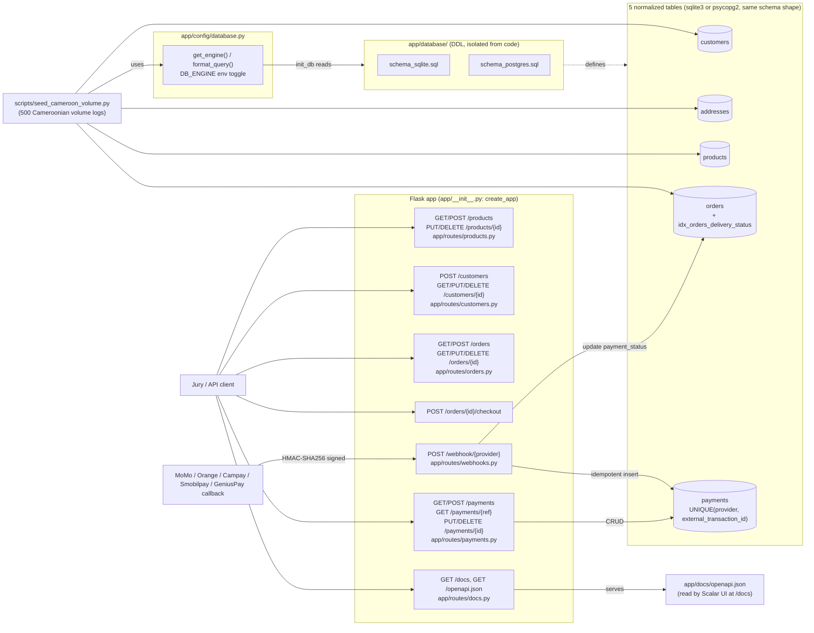

# AntCode Commando — E-Commerce Logistics Platform

*AntCode Hub 48-Hour Engineering Sprint — Scenario B (E-Commerce Logistics Crisis) · Track 2 (Backend / Fullstack Engineering)*

A Cameroon-focused e-commerce logistics backend: a clean, secure relational
CRUD architecture over a 5-table normalized schema (customers, addresses,
products, orders, payments), populated with realistic Cameroonian volume via
`scripts/seed_cameroon_volume.py`, exposing full CRUD for products/customers/
orders plus idempotent MTN MoMo / Orange Money / Campay / Smobilpay /
GeniusPay payment callbacks. Built strictly test-first — see
[`.agents/skills/test-driven-development/SKILL.md`](.agents/skills/test-driven-development/SKILL.md).

## Architecture



Neighborhood filtering (`GET /orders?neighborhood=...`) joins `orders` to
`addresses` rather than keeping a denormalized copy on `orders` — see
[`docs/indexing_and_query_optimization_report.md`](docs/indexing_and_query_optimization_report.md).

## Project layout

```
app/
├── __init__.py                     # create_app() factory (zero-arg, loads Config), registers blueprints
├── config/
│   ├── database.py                 # get_connection(), init_db(), get_engine(), format_query()
│   │                                #   -- toggles sqlite3 / psycopg2 via DB_ENGINE env var
│   └── settings.py                 # Config class -- app.config.from_object() source, mirrors env vars
├── database/
│   ├── schema_sqlite.sql           # the 5-table schema + indexes (sqlite3)
│   └── schema_postgres.sql         # same schema adapted for PostgreSQL (SERIAL/VARCHAR/TIMESTAMP)
├── docs/
│   └── openapi.json                # OpenAPI 3.0 spec (static file, served as-is)
├── routes/
│   ├── customers.py                # POST /customers, GET/PUT/DELETE /customers/{id}
│   ├── docs.py                     # GET /docs (Scalar UI), GET /openapi.json
│   ├── orders.py                   # GET/POST /orders, GET/PUT/DELETE /orders/{id}, checkout, sync
│   ├── payments.py                 # GET/POST /payments, GET by transaction id, PUT/DELETE /payments/{id}
│   ├── products.py                 # GET/POST /products, PUT/DELETE /products/{id}
│   └── webhooks.py                 # POST /webhook/{provider}
└── services/
    ├── customers.py                # customer + address CRUD
    ├── geniuspay.py                 # GeniusPay checkout session initiation
    ├── orders.py                   # order CRUD, lookup, pagination, offline sync
    ├── payments.py                 # payment ledger CRUD (manual reconciliation/corrections)
    ├── products.py                 # product CRUD
    └── webhooks.py                 # idempotent multi-provider callback processing
scripts/
└── seed_cameroon_volume.py         # seeds 500 Cameroonian orders into the normalized tables
docs/
└── indexing_and_query_optimization_report.md
tests/
├── conftest.py                     # app/client fixtures shared by every test module
├── test_customers_routes.py
├── test_database.py
├── test_docs_routes.py
├── test_geniuspay.py
├── test_orders_routes.py
├── test_payments_routes.py
├── test_products_routes.py
├── test_seed_cameroon_volume.py
├── test_settings.py
└── test_webhooks.py
run.py                               # dev entry point (python run.py)
requirements.txt
README.md
```

## Getting started

```bash
pip install -r requirements.txt

# 1. Seed 500 realistic Cameroonian orders into the normalized tables
python scripts/seed_cameroon_volume.py

# 2. Run the API
MOMO_WEBHOOK_SECRET=your-momo-secret ORANGE_WEBHOOK_SECRET=your-orange-secret python run.py
```

`DB_ENGINE` defaults to `sqlite` (no env var needed for local dev). Set
`DB_ENGINE=postgresql` and `DATABASE_URL=...` to run against PostgreSQL
instead — `app/config/database.py` picks the matching schema file from
`app/database/` and swaps `?` placeholders for `%s` via `format_query()`
automatically.

### Running with any provider (MoMo, Orange, Campay, Smobilpay, GeniusPay)

`POST /webhook/{provider}` is a single dynamic route: `_webhook(provider)`
(`app/routes/webhooks.py`) resolves that provider's own secret and
signature header straight from `_PROVIDER_CONFIG`, keyed on the `provider`
URL segment. Adding a new provider is a config-map entry, not a new route.

```bash
CAMPAY_WEBHOOK_SECRET=secret python run.py
# then POST to /webhook/campay, signed with X-Campay-Signature
```

Every provider works the same way — swap the URL segment and its matching
secret env var: `/webhook/momo` + `MOMO_WEBHOOK_SECRET`, `/webhook/orange` +
`ORANGE_WEBHOOK_SECRET`, `/webhook/smobilpay` + `SMOBILPAY_WEBHOOK_SECRET`,
or `/webhook/geniuspay` + `GENIUSPAY_WEBHOOK_SECRET` (which additionally
requires `X-Webhook-Timestamp` and `X-Webhook-Event` headers, since
GeniusPay signs `f"{timestamp}.{raw_body}"` rather than the raw body
alone). A `provider` segment with no entry in `_PROVIDER_CONFIG` returns
500.

Then open **http://127.0.0.1:5000/docs** for the interactive Scalar API
reference, or **http://127.0.0.1:5000/openapi.json** for the raw spec.

## API

| Route | Method | Purpose |
|---|---|---|
| `/orders` | GET | List orders, optional `?neighborhood=` (joins `addresses`) and/or `?status=` (served by `idx_orders_delivery_status`) filters, plus `?page=` (default 1) and `?per_page=` (default 20). Response is `{"data": [...], "pagination": {"page", "per_page", "total_records", "total_pages"}}` |
| `/orders` | POST | Creates a single order. Accepts `customer_id` or `customer_name`+`customer_phone`+`neighborhood`(+`city`) (get-or-create), and `product_id` or `product_name`+`category`+`unit_price_fcfa` (get-or-create), plus `quantity`. `order_id` is auto-generated (`ECM-NNNNN`) if omitted |
| `/orders/{id_or_ref}` | GET | Fetch a single order by its own `order_id` (e.g. `ECM-00001`) or a payment's transaction reference (e.g. `MTX-A1B2C3D4E5`) — whichever one the caller has on hand. 404 if none match |
| `/orders/{order_id}` | PUT | Updates an order's `delivery_status` (`Pending`/`Shipped`/`Delivered`) and/or `payment_status` (`Paid`/`Unpaid`). 400 on an invalid value, 404 if the order doesn't exist |
| `/orders/{order_id}` | DELETE | Deletes an order. 404 if it doesn't exist, 409 if `payments` still reference it |
| `/orders/{order_id}/checkout` | POST | Triggers `initiate_geniuspay_payment()` (`app/services/geniuspay.py`) for `quantity * unit_price_fcfa` and returns `{"checkout_url", "transaction_reference"}`. 404 if the order doesn't exist, 502 if the outbound GeniusPay call fails |
| `/orders/sync` | POST | Bulk-ingests a JSON array of offline-captured orders (`app/services/orders.py::sync_offline_orders`). Idempotent on `order_id`: replaying an identical batch after a connectivity blackout skips every already-synced order instead of duplicating it. Returns `{"synced", "skipped"}` |
| `/products` | GET | Paginated product list (`?page=`, `?per_page=`) |
| `/products` | POST | Creates a product (`name`, `category`, `unit_price_fcfa`, optional `stock_quantity`). 400 on invalid fields |
| `/products/{id}` | PUT | Partially updates a product. 404 if unknown |
| `/products/{id}` | DELETE | Deletes a product. 404 if unknown, 409 if referenced by an order |
| `/customers` | POST | Creates a customer together with its first address (`full_name`, `phone_number` as `+2376XXXXXXXX`, `neighborhood`, `city`, optional `street_details`). 400 on invalid phone format, 409 on a phone already in use |
| `/customers/{id}` | GET | Fetch a customer with its nested `addresses`. 404 if unknown |
| `/customers/{id}` | PUT | Updates customer fields and/or its primary address's fields. 404 if unknown, 409 on a phone taken by another customer |
| `/customers/{id}` | DELETE | Deletes a customer and its addresses. 404 if unknown, 409 if the customer has existing orders |
| `/payments` | GET | Paginated payment ledger, newest first (`ORDER BY payment_id DESC`) |
| `/payments` | POST | Manually records a payment (offline cash, direct bank wire), enforcing `UNIQUE(provider, external_transaction_id)`. 400 on invalid fields, 404 if `order_id` doesn't exist, 409 on a duplicate `(provider, external_transaction_id)` |
| `/payments/{external_transaction_id}` | GET | Fetches a payment's full details with its order nested under `"order"`. 404 if no payment matches |
| `/payments/{payment_id}` | PUT | Updates `status` and/or `external_transaction_id` only — `order_id`/`provider`/`amount_fcfa` are immutable. 400 on invalid status, 404 if unknown, 409 on a reference collision |
| `/payments/{payment_id}` | DELETE | Deletes a payment log entry. 404 if unknown |
| `/webhook/{provider}` | POST | Payment callback for the named provider (`momo`, `orange`, `campay`, `smobilpay`, `geniuspay`). Requires that provider's own signature header (e.g. `X-Momo-Signature`, `X-Campay-Signature`, or `X-Webhook-Signature` + `X-Webhook-Timestamp` + `X-Webhook-Event` for `geniuspay`) keyed with its own secret, resolved dynamically from `_PROVIDER_CONFIG`. Idempotent on `(provider, external_transaction_id)`; an unrecognized `provider` returns 500 |
| `/webhook/simulate-carrier` | POST | **Dev-only** (404s unless the app runs with `debug=True`): bypasses signature verification entirely to fire a `momo`/`orange` callback straight from the Scalar UI, for demoing the payment lifecycle without hand-computing an HMAC. Never enable `debug` in production |
| `/docs` | GET | Interactive Scalar API reference — try all endpoints above from the browser |
| `/openapi.json` | GET | OpenAPI 3.0 spec backing `/docs` (`app/docs/openapi.json`) |

### 🧪 Live End-to-End Testing Scenarios

These three scenarios walk the full GeniusPay payment lifecycle by hand
against a running server (`python run.py`), either from the Scalar UI at
**http://127.0.0.1:5000/docs** or with `curl`. They exercise the exact same
guarantees `tests/test_geniuspay.py` and `tests/test_webhooks.py` already
assert with mocks — here you're watching them hold against the real
routes. Replace `1` below with a real `order_id` from `GET /orders` if
your database doesn't already have one.

#### Scenario 1 — Outbound Initiation

```bash
curl -X POST http://127.0.0.1:5000/orders/1/checkout
```

Expected response:

```json
{
  "checkout_url": "https://geniuspay.ci/pay/...",
  "transaction_reference": "..."
}
```

This is a *real* outbound `POST https://geniuspay.ci/api/v1/merchant/payments`
(`app/services/geniuspay.py::initiate_geniuspay_payment`), signed with
`GENIUSPAY_API_KEY`/`GENIUSPAY_API_SECRET` from `.env`. Without live
GeniusPay sandbox credentials there's nothing real to reach, so expect
`502 {"error": "payment initiation failed"}` instead — that's
`GeniusPayError` being caught cleanly, not a crash. Swap in real sandbox
keys to see an actual `checkout_url` come back.

#### Scenario 2 — Async Webhook Ingestion

**Option A — GeniusPay's real signature scheme.** GeniusPay signs
`f"{timestamp}.{raw_body}"`, so compute the signature before sending:

```bash
python3 - <<'PY'
import hashlib, hmac, json, time

secret = "dev-secret-change-me"  # your GENIUSPAY_WEBHOOK_SECRET
timestamp = str(int(time.time()))
body = json.dumps({"data": {"transaction_id": "GPAY-DEMO-01", "amount": 12000, "metadata": {"order_id": 1}}})
signature = hmac.new(secret.encode(), f"{timestamp}.{body}".encode(), hashlib.sha256).hexdigest()
print(f'curl -X POST http://127.0.0.1:5000/webhook/geniuspay \\\n  -H "X-Webhook-Signature: {signature}" \\\n  -H "X-Webhook-Timestamp: {timestamp}" \\\n  -H "X-Webhook-Event: payment.success" \\\n  -H "Content-Type: application/json" \\\n  -d \'{body}\'')
PY
```

Run the `curl` command it prints.

**Option B — the dev-only simulation route** (`momo`/`orange`, no
signature math required; only answers when the app runs with
`debug=True`, e.g. `python run.py`):

```bash
curl -X POST http://127.0.0.1:5000/webhook/simulate-carrier \
  -H "Content-Type: application/json" \
  -d '{"provider": "momo", "order_id": 1, "amount": 12000, "phone": "+237690000001", "external_transaction_id": "SIM-DEMO-01"}'
```

Either way, expected response:

```json
{"status": "processed", "payment_id": 1}
```

Confirm the order flipped to `Paid`, by `order_id`:

```bash
curl http://127.0.0.1:5000/orders/1
```

Or fetch the exact same order state using the *transaction reference*
the callback just recorded — no `order_id` needed at all, exactly what a
GeniusPay/MoMo/Orange confirmation screen would hand a customer back
(`GET /orders/{id_or_ref}` resolves this through
`get_order_by_transaction_reference()` against `payments.external_transaction_id`,
app/services/orders.py):

```bash
curl http://127.0.0.1:5000/orders/GPAY-DEMO-01      # if you used Option A
curl http://127.0.0.1:5000/orders/SIM-DEMO-01       # if you used Option B
```

A quick verification lookup showcasing the same transaction reference
against the payments ledger directly (`GET /payments/{external_transaction_id}`,
`app/routes/payments.py`) — the payment plus its order nested under
`"order"`, so a support agent double-checking a webhook's effect gets the
full picture in one call, right after the callback resolves:

```bash
curl http://127.0.0.1:5000/payments/GPAY-DEMO-01    # if you used Option A
curl http://127.0.0.1:5000/payments/SIM-DEMO-01     # if you used Option B
```

#### Scenario 3 — Double-Entry Replay Attack Safeguard

Resend the *exact same* request from Scenario 2 (identical
`external_transaction_id`) a second time:

```bash
curl -X POST http://127.0.0.1:5000/webhook/simulate-carrier \
  -H "Content-Type: application/json" \
  -d '{"provider": "momo", "order_id": 1, "amount": 12000, "phone": "+237690000001", "external_transaction_id": "SIM-DEMO-01"}'
```

Expected response — still `200`, but no new row written:

```json
{"status": "already_processed", "payment_id": 1}
```

`SELECT COUNT(*) FROM payments WHERE external_transaction_id =
'SIM-DEMO-01'` stays at `1` no matter how many times this is replayed —
the pre-flight lookup on `(provider, external_transaction_id)` (`UNIQUE`
in the schema) catches it before any insert, exactly as proven by
`test_momo_webhook_does_not_double_process_retried_callback` and
`test_simulate_carrier_webhook_is_idempotent_on_replay_when_debug_enabled`.

## Testing

```bash
python -m pytest -v
```

135 tests, 100% passing (`python -m pytest -v`). Every behavior above —
including the schema, the CRUD services/routes, the dual-engine connection
layer, the multi-provider webhooks, the GeniusPay checkout/webhook
lifecycle, the offline sync endpoint, the seeder, and the paginated order
lookup — was written test-first: a failing test proving the gap, then the
minimal code to close it, per the project's
[TDD skill](.agents/skills/test-driven-development/SKILL.md).

## Cameroonian context adaptation

### Volume seeder: three independent pools, not one duplicated per order

`scripts/seed_cameroon_volume.py` inserts realistic transaction logs straight
into the normalized tables through `get_connection()`/`format_query()` — no
raw staging table, no ETL step. `main()` first calls `reset_database()`
(drops every table, child-before-parent, then re-runs `init_db()`) so each
run starts from a pristine slate rather than accumulating on top of
whatever the file already held.

Three phases populate three genuinely independent pools, each fully built
before the next reads from it — an earlier revision instead created one new
address row per customer (500 near-duplicate rows for 5 neighborhoods),
which this structure now makes structurally impossible:

- **Reference data**: products (Electronics/Phones/Fashion, e.g.
  Tecno/Samsung/Infinix phones, TVs, wax print fabric) and a **fixed pool of
  5 logistics addresses**, get-or-created by name/(`neighborhood`, `city`)
  — one row per Douala/Yaoundé neighborhood (Akwa, Bonapriso → Douala;
  Bastos, Mendong, Biyem-Assi → Yaoundé), owned by no customer
  (`addresses.customer_id IS NULL`).
- **100 distinct customers**, each with a real-looking Cameroonian full
  name and a unique `+2376XXXXXXXX` mobile number — no address of their own
  at this stage.
- **500 orders**, each picking an *existing* `customer_id`, `address_id`,
  and `product_id` at random from the pools above (never creating a new
  one), with a random quantity, one of the three tracking states
  (`Pending`/`Shipped`/`Delivered`), and a sequential `order_id`
  (`ECM-NNNNN`).

This mirrors real e-commerce behavior directly: customers place multiple
orders, and many orders/customers share the same canonical delivery zone.
`app/services/orders.py::_get_or_create_address()` (used by this seeder,
`POST /orders`, and `POST /orders/sync`) is keyed purely on
`(neighborhood, city)` for exactly this reason — contrast with a customer's
own *registered* address in `app/services/customers.py`, which legitimately
belongs to that one customer and is a separate, unaffected code path.

Verified by `tests/test_seed_cameroon_volume.py`: exactly 5 address rows
(one per neighborhood, `customer_id IS NULL`) and 100 customers regardless
of how many of the 500 orders are generated; every order's `customer_id`/
`address_id` comes from the pre-populated pool, not a fresh insert; every
phone number unique and `+2376`-formatted; and `reset_database()` verified
to zero every table before a second seeding run reproduces the same counts.

### Network timeout protection: idempotent webhook

3G connectivity drops in Douala/Yaoundé are routine, and payment providers
retry a callback when they don't get an acknowledgement in time. If that
retry were processed twice, an order could get double-charged or its
`payment_status` flipped back and forth. `POST /webhook/momo`
(`app/services/webhooks.py::process_momo_callback`) gates on
`payments.external_transaction_id`, which is `UNIQUE` in the schema: the
first callback for a given transaction ID inserts the payment and updates
the order; every retry of that same transaction ID is recognized before any
write and answered with `{"status": "already_processed"}` — same result,
zero duplicate writes. Enforced at both the application layer (a lookup
before insert) and the database layer (the `UNIQUE` constraint as a
backstop), and proven by
`tests/test_webhooks.py::test_momo_webhook_does_not_double_process_retried_callback`,
which posts the identical callback twice and asserts exactly one payment
row exists afterward.

Authenticity is checked with a real HMAC, not a bare shared secret: the
caller sends `X-Momo-Signature`, the hex HMAC-SHA256 of the *raw request
body* keyed with `MOMO_WEBHOOK_SECRET`
(`app/routes/webhooks.py::_has_valid_signature`, compared with
`hmac.compare_digest` to avoid timing attacks). That binds the signature to
the exact bytes received, so a signature computed over one payload will not
validate a tampered one — proven by
`test_momo_webhook_rejects_tampered_payload_even_with_valid_looking_signature`,
which reuses a genuine signature against a modified `amount_fcfa` and
asserts it's rejected.

### Limit/Offset pagination: saving 3G data and battery

`GET /orders` with no bounds would ship every row in one response —
expensive on the metered, throttled 3G/4G connections common in Douala and
Yaoundé, and on phones where every extra second of radio activity drains the
battery. `app/services/orders.py::list_orders()` now takes `page`/`per_page`
(defaults 1/20) and appends `LIMIT ? OFFSET ?` to the query — through
`format_query()`, so the same code paginates correctly whether the query
runs against sqlite3 or PostgreSQL. The response never asks a client to
guess: `pagination.total_records` and `pagination.total_pages` are computed
from a `COUNT(*)` over the *same* filtered `WHERE` clause as the page
itself, so a field agent's app can request exactly the next page it needs —
and nothing more — instead of re-fetching or truncating a full list
client-side.

### Dual-operator webhook safety gates

Field agents and customers pay with whichever operator has signal and float
at the moment — MTN MoMo and Orange Money both, often interchangeably.
`POST /webhook/momo` and `POST /webhook/orange` are two distinct Flask
routes (`app/routes/webhooks.py`), each checked against its *own* shared
secret (`MOMO_WEBHOOK_SECRET` / `ORANGE_WEBHOOK_SECRET`) and its own
signature header (`X-Momo-Signature` / `X-Orange-Signature`) before either
touches the database — a request signed with Orange's secret is rejected on
the momo route and vice versa
(`test_momo_webhook_rejects_orange_signature_for_the_momo_route`). The
provider identity stored against each payment is taken from the *route
that verified the signature*, never from a client-supplied field in the
JSON body, closing off a class of bug where a forged or mistaken `provider`
value in the payload could point a payment at the wrong operator's ledger.

This also fixes a latent collision risk: the idempotency lock used to be
keyed on `external_transaction_id` alone, so if MTN and Orange ever
independently minted the same transaction ID string, the second operator's
real payment would have been silently discarded as a duplicate. The lock is
now `UNIQUE(provider, external_transaction_id)` in both schema files, and
`test_momo_and_orange_callbacks_reusing_the_same_transaction_id_are_independent`
posts the same transaction ID to both routes and asserts both are processed
as distinct payments.

## AI Prompt Ledger

This project was built entirely with Claude Code, directed through a
recurring interactive protocol: **`/plan`** to work out an approach before
writing code, for the handful of phases where the shape of a change wasn't
obvious enough to go straight into TDD; **`/goal`** to hand off a scoped,
multi-step directive for autonomous red/green/refactor execution;
**`/context`** to check token budget mid-session; and **`/clear`** to reset
context between unrelated phases once it had grown large enough that
carrying it forward risked stale state bleeding into the next task.
**`/run`**, in this project's transcripts, was used not for its more common
"launch and drive an app" purpose but to execute the verified `git add`/
`git commit` for a phase once its full suite was green.

Not every phase fits that clean a story: `/plan` mode was auto-toggled by
the CLI around this project's very first `/goal` directive with no
separate planning dialogue to log — that directive already scoped the work
precisely enough to skip straight to TDD — and a couple of phases were
driven by a plain, non-`/goal` prompt instead. Both are called out where
they occur rather than folded silently into the table below.

The table groups this repository's ~30 commits into the seven
architectural milestones that make up its current shape, rather than
listing every commit as its own row — full commit-by-commit granularity
remains one `git log` away. Two rows below the table sit outside any single
milestone on purpose: they're self-corrections, and better evidence of
*directing* the AI than any polished result would be.

| Phase | Trigger | Scope | Result |
|---|---|---|---|
| **Schema Normalization** | `/goal` (multiple) | Began as a 6-table scaffold fed by a raw CSV/ETL staging step (`ecommerce_orders_raw` → `pipeline.py`); grew a dual-engine config layer (`get_engine()`/`format_query()`, `sqlite3` or `psycopg2` off one `DB_ENGINE` toggle); then fully normalized to today's 5-table shape (`customers`, `addresses`, `products`, `orders`, `payments`) by deleting the ETL demo outright and replacing `order_items` plus a denormalized `orders.customer_neighborhood` column with `orders.product_id`/`quantity`/`unit_price_fcfa` and a join to `addresses`. Later collapsed a redundant `orders.external_ref` into `orders.order_id` itself, once the business identifier (`"ECM-00795"`) turned out to already be unique and caller-supplied. | `abf00a7` → `3382a8b` (32 tests) → `48d0f23` (37) → `af8a86e` (39) → `620c6c6` → `5963daa` (102, current 5-table shape) |
| **Cameroonian Seeder Volume** | `/goal` ×2 | `scripts/seed_cameroon_volume.py` seeds 500 realistic Cameroonian orders across three independent pools — reference products plus 5 fixed logistics addresses, 100 distinct customers, then 500 orders drawn from those pools — with `reset_database()` for a pristine slate on every run. A follow-up directive fixed a real normalization bug the first pass introduced: one new `addresses` row per customer instead of a shared pool keyed on `(neighborhood, city)`, fixed by making `addresses.customer_id` nullable. | `5963daa` (102 tests) → `5fe004b` (107) |
| **REST CRUD Routes Overhaul** | `/goal` (multiple) | Full CRUD grid across `products`, `customers`, `orders`; `GET /orders/{id_or_ref}` resolving either the order's own id or a payment's transaction reference; `GET /orders` gaining `page`/`per_page` with a `{data, pagination}` envelope computed from the same filtered `WHERE` clause as the page itself; `POST /orders/sync` for idempotent bulk offline-order ingestion. | `3f0f16c` (44 tests, pagination) → `86a52d2` → `4d9d7d4` → `5963daa` (102 — same commit as the seeder above) |
| **Webhook Unification** | `/goal` (multiple) | Two hardcoded `momo`/`orange` routes, each with its own idempotency check, collapsed step by step into a single dynamic `POST /webhook/{provider}` keyed on a `_PROVIDER_CONFIG` map — first behind a `DEFAULT_AGGREGATOR`-routed indirection for `campay`/`smobilpay`, then a final pass deleted all four standalone routes (`momo`, `orange`, `geniuspay`, `aggregator`) in favor of one route for every provider. The idempotency key itself was upgraded from `external_transaction_id` alone to `UNIQUE(provider, external_transaction_id)` after recognizing two operators could independently mint the same transaction id and silently clobber each other's payment. | `957ae90` (43 tests) → `8ec8864` (47) → `01f1ba9` (single route, all 5 providers) |
| **GeniusPay Timestamp-Bound HMAC verification** | `/goal` (multiple) | Integrated GeniusPay's Merchant API for outbound checkout session creation, then a production-grade inbound webhook layer that signs `f"{timestamp}.{raw_body}"` — not the raw body alone — verified against `X-Webhook-Signature`/`X-Webhook-Timestamp`/`X-Webhook-Event`. Defensive parsing was added after discovering GeniusPay's own dashboard "send test event" button fires with no `data`/`metadata` block at all. | `2120bf7` → `3c7c446` (65 tests) → `8fc50f0` → `46b1600` → `a2e074d` (78 tests; also added the dev-only `/webhook/simulate-carrier` route and the Live End-to-End Testing Scenarios section below) — folded into `01f1ba9`'s single unified route above |
| **Accounting Ledger Immutability** | `/goal` ×2 | Direct CRUD over the `payments` ledger (`POST`/`GET`/`PUT`/`DELETE`), distinct from the webhook path which only ever inserts a payment as a side effect of a callback; `order_id`/`provider`/`amount_fcfa` immutable once recorded, only `status`/`external_transaction_id` mutable. Most recently, separated the order's binary payment visibility (`payment_status`: `Paid`/`Unpaid`) from a payment attempt's own transactional state (`payments.status`: `pending`/`completed`/`failed`) — a failed or still-pending attempt no longer leaves the order in a `Failed` state that conflated attempt-level and order-level meaning. | `0f8610d` (135 tests) → `5f8f421` → `13e8446` (135, current) |
| **Temporal Tracking via DB Triggers** | `/goal` | `updated_at` on `products`/`customers`/`addresses`, auto-refreshed at the database layer so no caller can forget to bump it: one `AFTER UPDATE` trigger per table in sqlite (millisecond-resolution `STRFTIME` default, since bare `CURRENT_TIMESTAMP`'s 1-second resolution let an insert-then-update test land in the same second and hide a real change), one reusable `set_updated_at()` function fired `BEFORE UPDATE` on all three tables in postgres. | `7542010` (115 tests) |

Two self-corrections sit outside the table because they aren't tied to any
one milestone, and they're the clearest evidence in this repository of
*directing* the AI rather than accepting its output on faith:

- **Caught a bug the AI itself introduced.** A Mermaid diagram edge label
  with embedded double quotes broke GitHub's renderer — found and fixed in
  the same session (`0d9ebc3`).
- **Declined false-premise directives.** Several `/goal` prompts across
  this project described a bug, a missing feature, or a "truncated" README
  section that, on inspection of the actual files by line number, did not
  exist. Each was verified against the real code first and reported back
  as a false premise rather than answered with a fabricated fix for a
  non-problem.

Each phase above followed the same discipline: RED (a failing test proving
the gap) → GREEN (the minimal code to close it) → REFACTOR (clean up
without changing behavior), the full suite green before the phase counted
as done. `python -m pytest -v` is the single source of truth for "is this
actually finished" throughout — not manual inspection.

## Production readiness roadmap

Two gaps stand between this API and a real production deployment, neither
implemented yet:

- **CORS.** There is currently no `Access-Control-Allow-Origin` handling
  anywhere in `app/__init__.py` or the route blueprints, so a browser-based
  dashboard served from a different origin cannot call `/orders` or the
  webhook routes directly. Adding `flask-cors` (or hand-rolled
  `after_request` headers) scoped to the dashboard's actual origin — not a
  blanket `*` — would be the next step.
- **Authentication on lookup routes.** `GET /orders` and
  `GET /orders/{order_id}` are open today: anyone who can reach the server
  can list every customer's orders. The webhook routes are already gated by
  per-provider HMAC signatures, but the read routes have no equivalent.
  Before this serves real delivery drivers or a dashboard, it needs either
  short-lived JWTs issued to authenticated dashboard users, or a simpler
  per-driver static API key (a "driver key") checked in an
  `@before_request` hook — whichever matches how drivers actually
  authenticate in the field (a JWT implies a login flow; a driver key
  implies a provisioning step per device instead).

Also still open from earlier phases: `schema_postgres.sql` and the
PostgreSQL branch of `get_connection()`/`init_db()`/`get_last_row_id()` have
never run against a live PostgreSQL server (none is available in this
project's environment) — validated by code review and mocked unit tests
only, not an end-to-end run. And `scripts/seed_cameroon_volume.py::main()`
still checks for existing tables via `SELECT name FROM sqlite_master WHERE
type='table'` — a sqlite-only system table — so this script would need a
`get_engine()` branch (e.g. `information_schema.tables` on PostgreSQL)
before it could seed a Postgres instance.
