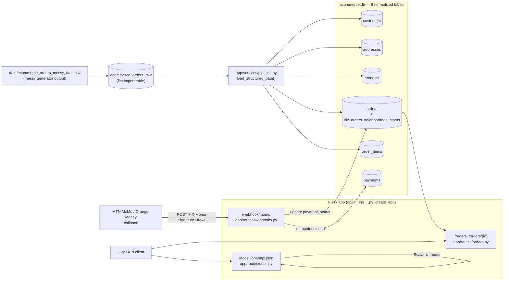

# AntCode Commando — E-Commerce Logistics Platform

A Cameroon-focused e-commerce logistics backend: it ingests a deliberately
messy raw orders export, cleans and normalizes it into a relational SQLite
schema, exposes neighborhood/delivery-status order lookups over a composite
index built for that access pattern, and processes idempotent MTN MoMo /
Orange Money payment callbacks. Built strictly test-first — see
[`.agents/skills/test-driven-development/SKILL.md`](.agents/skills/test-driven-development/SKILL.md).

## Architecture



`orders` carries a denormalized snapshot of `customer_neighborhood` and
`delivery_status` (alongside the normalized `addresses` table) specifically
so `idx_orders_neighborhood_status` can answer neighborhood/status lookups
without a join — see
[`docs/indexing_and_query_optimization_report.md`](docs/indexing_and_query_optimization_report.md).

## Project layout

```
app/
  __init__.py          create_app() factory, registers all blueprints
  database.py           get_connection(), init_db()
  schema.sql             the 6-table schema + indexes
  openapi.json             OpenAPI 3.0 spec (static file, served as-is)
  routes/
    orders.py              GET /orders, GET /orders/{id}
    webhooks.py             POST /webhook/momo
    docs.py                   GET /docs (Scalar UI), GET /openapi.json
  services/
    pipeline.py             ecommerce_orders_raw -> 6 tables ETL
    orders.py                 order lookup queries
    webhooks.py                idempotent MoMo callback processing
scripts/
  generate_mock_transactions.py   generates the messy CSV + loads ecommerce_orders_raw
  load_structured_orders.py        runs the ETL against ecommerce.db
docs/
  indexing_and_query_optimization_report.md
tests/                  one file per module above, plus conftest.py fixtures
run.py                  dev entry point (python run.py)
```

## Getting started

```bash
pip install -r requirements.txt

# 1. Generate the messy raw dataset and load it into ecommerce_orders_raw
python scripts/generate_mock_transactions.py

# 2. Clean/normalize it into the 6 structured tables
python scripts/load_structured_orders.py

# 3. Run the API
MOMO_WEBHOOK_SECRET=your-secret python run.py
```

Then open **http://127.0.0.1:5000/docs** for the interactive Scalar API
reference, or **http://127.0.0.1:5000/openapi.json** for the raw spec.

## API

| Route | Method | Purpose |
|---|---|---|
| `/orders` | GET | List orders, optional `?neighborhood=` and/or `?status=` filters — served by `idx_orders_neighborhood_status` |
| `/orders/{order_id}` | GET | Fetch a single order (404 if unknown) |
| `/webhook/momo` | POST | MTN MoMo / Orange Money payment callback. Requires `X-Momo-Signature`: hex HMAC-SHA256 of the raw body, keyed with `MOMO_WEBHOOK_SECRET`. Idempotent on `external_transaction_id` |
| `/docs` | GET | Interactive Scalar API reference — try both endpoints above from the browser |
| `/openapi.json` | GET | OpenAPI 3.0 spec backing `/docs` |

## Testing

```bash
python -m pytest -v
```

32 tests, 100% passing. Every behavior above — including the schema, the
ETL, the indexing, and the webhook — was written test-first: a failing test
proving the gap, then the minimal code to close it, per the project's
[TDD skill](.agents/skills/test-driven-development/SKILL.md).

## Cameroonian context adaptation

### ETL choice: synthesizing identity the raw data doesn't have

`ecommerce_orders_raw` is a flat logistics export — one row per order, with
a neighborhood and a product category, but **no customer name/phone and no
product SKU**. A normalized schema needs real entities, so
`app/services/pipeline.py::load_structured_data()` makes two explicit,
documented calls rather than silently guessing:

- **One synthetic customer per raw order row**, deterministically derived
  from the raw `order_id` (the only stable identity the source offers) —
  matching the actual grain of the data instead of inventing a fake
  dedup key.
- **Products deduped by category**, with the master `unit_price_fcfa` taken
  from the first valid row seen for that category; each `order_items` row
  still keeps its own transactional price from the raw record, so historical
  pricing isn't lost to the dedup.
- **Neighborhood → city** is resolved from a real Douala/Yaoundé lookup
  table (`NEIGHBORHOOD_CITY` in `pipeline.py`) — Akwa, Bonapriso,
  Bonamoussadi, Deido and New Bell map to Douala; Bastos, Mendong, Nlongkak,
  Biyem-Assi and Ngousso map to Yaoundé — rather than a placeholder city.

### The Biyem-Assi text-collapsing anomaly

The raw generator injects casing noise (`akwa`, `AKWA`, `Akwa `) *and*, for
hyphenated neighborhoods, a **space variant** — `Biyem-Assi` also appears as
`Biyem Assi`. A naive `.title()` pass fixes casing but leaves `Biyem Assi`
and `Biyem-Assi` as two different strings, which would silently split one
neighborhood's orders across two buckets in every downstream count and in
`idx_orders_neighborhood_status` itself.

`normalize_neighborhood()` catches this by snapping any casing/spacing
variant of a known neighborhood to one canonical spelling (see
`_canon_key()` / `_CANONICAL_NEIGHBORHOODS` in `pipeline.py`), verified by
`tests/test_pipeline.py::test_normalize_neighborhood_collapses_hyphen_space_variant_to_canonical_name`
and confirmed end-to-end against the full 912-row loaded dataset: exactly
10 distinct neighborhoods, no duplicates.

### Network timeout protection: idempotent webhook

3G connectivity drops in Douala/Yaoundé are routine, and payment providers
retry a callback when they don't get an acknowledgement in time. If that
retry were processed twice, an order could get double-charged or its
`payment_status` flipped back and forth. `POST /webhook/momo`
(`app/services/webhooks.py::process_momo_callback`) gates on
`payments.external_transaction_id`, which is `UNIQUE` in the schema: the
first callback for a given transaction ID inserts the payment and updates
the order; every retry of that same transaction ID is recognized before any
write and answered with `{"status": "already_processed"}` — same result,
zero duplicate writes. Enforced at both the application layer (a lookup
before insert) and the database layer (the `UNIQUE` constraint as a
backstop), and proven by
`tests/test_webhooks.py::test_momo_webhook_does_not_double_process_retried_callback`,
which posts the identical callback twice and asserts exactly one payment
row exists afterward.

Authenticity is checked with a real HMAC, not a bare shared secret: the
caller sends `X-Momo-Signature`, the hex HMAC-SHA256 of the *raw request
body* keyed with `MOMO_WEBHOOK_SECRET`
(`app/routes/webhooks.py::_has_valid_signature`, compared with
`hmac.compare_digest` to avoid timing attacks). That binds the signature to
the exact bytes received, so a signature computed over one payload will not
validate a tampered one — proven by
`test_momo_webhook_rejects_tampered_payload_even_with_valid_looking_signature`,
which reuses a genuine signature against a modified `amount_fcfa` and
asserts it's rejected.

## AI Prompt Ledger

This project was built with Claude Code, directed through three recurring
commands: **`/goal`** to hand off a scoped, multi-step directive for
autonomous TDD execution; **`/clear`** to reset context between unrelated
phases so each phase starts from a clean slate instead of accumulating
unrelated history; and **`/plan`**, available for phases where the approach
itself needs to be worked out with a human before any code is written (not
required for the phases below, since each `/goal` directive already scoped
the work precisely enough to go straight into the TDD red/green/refactor
loop).

| Phase | Trigger | Scope | Result |
|---|---|---|---|
| Initial scaffold | *(prompt predates this session's context — not preserved; see commit `abf00a7`)* | Repo scaffold: `app/schema.sql` (6-table schema), `app/database.py`, TDD skill files | `abf00a7 first commit` |
| Mock data generation | *(prompt predates this session's context — not preserved; see commit `268d41b`)* | Messy CSV generator, `ecommerce_orders_raw` loader, `clean_row`/`insert_orders` tests | `268d41b feature: data processing` |
| — | `/clear` | Context reset before Phase 3 | — |
| Phase 3: Data Pipeline, Indexing, Webhooks | `/goal` | ETL from `ecommerce_orders_raw` into the 6 tables with neighborhood normalization; `idx_orders_neighborhood_status`; `docs/indexing_and_query_optimization_report.md`; idempotent `POST /webhook/momo` | Schema migration, `pipeline.py`, indexing report, webhook route/service — 24 tests passing |
| — | `/clear` | Context reset before Phase 4 | — |
| Phase 4: Final Validation | `/goal` | `/docs` interactive API reference (Scalar), order lookup endpoints, this README, full-suite green check | `app/openapi.py`, `app/routes/docs.py`, order lookup routes, this README — 30 tests passing |
| Phase 5: Consolidation & HMAC hardening | `/goal` (same session, no `/clear` before it) | Re-verify all prior phases against elite architecture specs; upgrade webhook auth from a bare shared-secret header to a real HMAC-SHA256 signature over the raw body; move the OpenAPI spec from a Python dict to a static `app/openapi.json` file | `_has_valid_signature()` in `app/routes/webhooks.py`, `app/openapi.json` (replaces `app/openapi.py`), 2 new tests (missing/wrong-secret signature, tampered-payload rejection) — 32 tests passing |

Each `/goal` phase followed the same discipline: RED (failing test proving
the gap) → GREEN (minimal code to close it) → REFACTOR (clean up without
changing behavior), verified by running the full suite before considering
the phase done. `python -m pytest -v` is the single source of truth for
"is this actually finished" throughout — not manual inspection.
